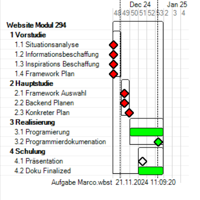

# Modul294-Webseite  
**Planung der Arbeitschritte**  



---
## Geleistete Vorarbeit  

Im Rahmen der **Vorstudie** haben wir uns intensiv mit den Grundlagen und der Vorbereitung des Projekts beschäftigt. Die wichtigsten Punkte umfassen:  

### 1. Analyse der aktuellen Lage  
- Eine Situationsanalyse wurde durchgeführt, um die Anforderungen und Ziele des Projekts zu definieren.  
- Es wurden Herausforderungen identifiziert, die speziell für die Umsetzung eines Ski-Service-Webshops relevant sind.  

### 2. Erforschung von Optionen  
- Verschiedene **Frameworks** wurden analysiert, um die bestmögliche technische Basis für das Projekt auszuwählen.  
- Inspirationsquellen wie existierende **Webshops** und **Design-Ideen** wurden untersucht, um kreative und funktionale Impulse für die Gestaltung der Webseite zu erhalten.  

## Design-Philosophie  
Unsere Design-Philosophie basiert auf den Grundprinzipien von:  
1. **Benutzerfreundlichkeit**  
2. **Responsivität**  
3. **Ästhetik**  

### Ziele:  
- Ein **modernes** und **übersichtliches Interface** gestalten  
- **Intuitive Bedienung** für Nutzer gewährleisten  
- Die Farbgebung und das Layout so designen, dass sie die **winterliche Atmosphäre** eines Ski-Shops widerspiegeln  

Dabei bleibt die **Funktionalität** stets im Fokus.  

---

## Bootstrap-Integration  
Um die Entwicklung effizient zu gestalten, haben wir uns für die Nutzung von **Bootstrap** entschieden.  
Es bietet eine Vielzahl von vorgefertigten Komponenten und Layouts, die einfach zu implementieren sind und die Gestaltung responsiver Webseiten erleichtern.  

Wir haben spezifische Elemente wie:  
- **Navigation**  
- **Grid-Systeme**  
- **Buttons**  

ausgewählt, um ein ansprechendes und funktionales Design zu schaffen.  

---

## Thema der Webseite  
Das zentrale Thema unserer Webseite ist ein **Mini-Shop**, der sich auf Ski-Service spezialisiert.  

Dieser Shop simuliert typische Aufgaben und Herausforderungen eines modernen Webshops, wie:  
- die **Darstellung von Dienstleistungen**  
- die **Handhabung von Kundenanfragen**  
- die **Integration von Buchungsfunktionen**  

Ziel ist es, ein realitätsnahes Beispiel für die Praxisarbeit zu schaffen.  

---


# Backend Code

Erklärung des Backend codes den wir für das Projekt erstellt haben. Ich werde euch unsern code in kleinen abschnitten erklären so das es auch jeder versteht.

## Abschnitt 1

```javascript
document.getElementById("serviceForm").addEventListener("submit", function(e) { });
```

Der Code wartet auf das event, dass das Formular mit der ID serviceForm abgeschickt wird.
Wenn das Formular abgeschickt wird, wird die angegebene Funktion ausgeführt.


## Abschnitt 2

```javascript
e.preventDefault();
```

Das Standardverhalten des Formulars (die Seite neu zu laden) wird verhindert, sodass der Code die Daten programmgesteuert verarbeiten kann.

## Abschnitt 3

```javascript
const name = document.getElementById("name").value;
const email = document.getElementById("email").value;
const phone = document.getElementById("phone").value;
const service = document.getElementById("service").value;
const priority = document.getElementById("priority").value;
```

Die Werte aus den inputfeldern (name, email, phone, service, priority) werden abgerufen und in die Variablen gespeichert.
so Können  wir die daten später ausslesen unhd posten.

## Abschnitt 4

```javascript
const priorityDays = {
    "Tief": 12,
    "Standard": 7,
    "Express": 5
};
```

Ein Objekt wird erstellt, das für jede Priorität (Tief, Standard, Express) eine Anzahl von Tagen enthält, die zu einem bestimmten Datum hinzugerechnet werden.

## Abschnitt 5

```javascript
const today = new Date();
today.setDate(today.getDate() + priorityDays[priority]);
```

Ein neues Datum (today) wird erstellt, das den aktuellen Tag repräsentiert.
Basierend auf der gewählten Priorität wird die Anzahl der Tage (aus dem priorityDays-Objekt) zum aktuellen Datum hinzugefügt.

## Abschnitt 6

```javascript
const pickupDate = today.toISOString().split('T')[0];
```

Das Datum wird in ISO-Format (z.B. "2024-11-20T12:34:56.789Z") umgewandelt und anschließend mit .split['T'](0) nur das Datum (ohne Uhrzeit) extrahiert.

## Abschnitt 7

```javascript
const data = {
    name,
    email,
    phone,
    service,
    priority,
    created_at: new Date().toISOString().split('T')[0],
    pickup_date: pickupDate
};
```

Ein data-Objekt wird erstellt, das alle erfassten Formulardaten enthält.
Zusätzlich wird das Erstellungsdatum (created_at) in einem ähnlichen Format wie das Pickup-Datum gespeichert.

## Abschnitt 8

```javascript
console.log(data);
```

Die erstellten Daten werden in der Konsole ausgegeben, um zu überprüfen, was gesendet wird.

## Abschnitt 9

```javascript
fetch("http://localhost:5000/api/registration", {
    method: "POST",
    headers: { "Content-Type": "application/json" },
    body: JSON.stringify(data)
})
```

Eine POST-Anfrage wird an das Backend gesendet. Die URL <http://localhost:5000/api/registration> ist der Endpunkt, an den die Formulardaten gesendet werden.
Der Content-Type-Header gibt an, dass die gesendeten Daten im JSON-Format sind.
Der body enthält die Formulardaten, die in einen JSON-String umgewandelt werden.

## Abschnitt 10

```javascript
.then(response => response.json())
  .then(result => alert("Anmeldung erfolgreich!"))
  .catch(error => console.error("Fehler:", error));
```

Wenn die Anfrage erfolgreich ist, wird die Antwort als JSON verarbeitet und eine Erfolgsmeldung angezeigt.
Wenn ein Fehler auftritt, wird dieser in der Konsole protokolliert.
